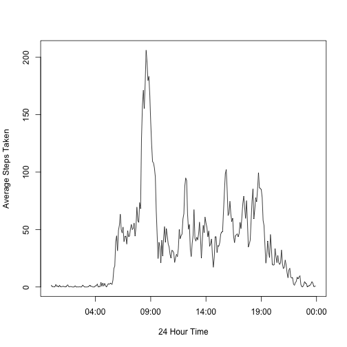

## Activity Level Data Analysis

This report looks at some of the trends from a fitness band that tracked activity on an individual from October 1, 2012 to Novmber 30, 2012. The data consists of the number of steps taken in a 5 minute interval, the date, and the interval during the day. 

The first step is to read in the dataset as `raw`.


```r
raw <- read.csv("activity.csv", sep = ",")
raw$date <- as.POSIXct(raw$date, format = "%Y-%m-%d")   # Convert date to POSIXct object

# Convert 5-min intervals into times (Group_by needs POSIXct, not POSIXlt)
raw$time <- as.POSIXct(strptime(sprintf('%04d', raw$interval), format='%H%M'))  
```

## Daily Totals

What is the mean total number of steps taken per day? To do this, we sum the total number of steps taken per day `total_per_day` and create a histogram showing the distribution of daily total steps. We then calculate the median and mean of this distribution.


```r
# Sum the total steps per days, grouping by date
library(dplyr)
total_per_day <- raw %>% group_by(date) %>% summarize(total = sum(steps, na.rm = T))

# Plot a histogram of total steps per day, ignore NA values
hist(total_per_day$total, 15, 
     xlab = "Total steps taken per day", 
     main = "Histogram of Total Steps (raw data)", 
     col = "lightgreen")
```

 

### Median of raw data


```r
# Calculate the median daily total
median(total_per_day$total)
```

```
## [1] 10395
```

### Mean of raw data


```r
# Calculate the mean daily total
mean(total_per_day$total)
```

```
## [1] 9354.23
```

## Daily Activity Levels

What is the average daily activty level? 

```r
# Average daily acitivty, grouping by the daily 5-min time interval
avgDaily <- raw %>% group_by(time) %>% summarize(average = mean(steps, na.rm = T))
plot(avgDaily$time, 
     avgDaily$average, 
     type = "l", 
     xlab = "24 Hour Time", 
     ylab = "Average Steps Taken")
```

 

```r
# Calculate in which 5-min time interval the maximum average activity level occurs
maxInt <- strftime(avgDaily$time[which.max(avgDaily$average)], format = "%H:%M")
```

### Maximum 5-min interval

The maximum average 5-min interval occurs at **08:35**. This can be attributed to the morning rush hour commute.

## Creating Tidy Data

The total number of `NA` values in the raw data is **2304** and is found via `sum(is.na(raw$steps))`.

Using the mean step values from the different 5-min time intervals, we replace the `NA` values so that we have a tidy dataset (`tidy`) where each row is a complete observation. This is done using the following code.


```r
# Replace NA values with mean values from equivalent intervals on other days
tidy <- raw
for (i in 1:length(tidy$steps)) {
        if (is.na(tidy$steps[i])) {
                int <- tidy$time[i]
                tidy$steps[i] <- avgDaily$average[avgDaily$time == int]
        }
}
```

Using the `tidy` dataset, we now plot a histogram of total daily activity and find the new median and mean.


```r
# Plot histogram of tidy data
total_per_day_tidy <- tidy %>% group_by(date) %>% summarize(total = sum(steps))
hist(total_per_day_tidy$total, 15, 
     xlab = "Total steps taken per day", 
     main = "Histogram of Total Steps (tidy data)",
     col = "green")
```

 

### Median of tidy data


```r
# Calculate the median daily total
median(total_per_day_tidy$total)
```

```
## [1] 10766.19
```

### Mean of tidy data


```r
# Calculate the mean daily total
mean(total_per_day_tidy$total)
```

```
## [1] 10766.19
```

The median and mean of the `tidy` dataset are both larger than those of the `raw` dataset. This is due to additional mean values that were added to the tidy dataset. 

## Weekends vs. Weekdays

To determine what differences, if any, are present in activity levels taken on the weekend vs. a weekday, first we label each date with the type of day it is. We then group the `tidy` data by `time, day` and take the mean of the resultant, grouped, dataset. 


```r
library(ggplot2)
library(scales)
days <- weekdays(tidy$date)

for (i in 1:length(days)) {
        if (days[i] == "Saturday" | days[i] == "Sunday") {
                tidy$day[i] = "Weekend"
        } else  tidy$day[i] = "Weekday"
}

avgDayType <- tidy %>% group_by(time, day) %>% summarize(average = mean(steps, na.rm = T))

# Create a panel plot of average daily activity for weekdays and weekends
g <- ggplot(avgDayType, aes(time, average))
p <- g + geom_line() + facet_grid(day ~ .) + 
        scale_x_datetime(breaks = date_breaks("2 hour"),  labels = date_format("%H:%M", tz = "America/Los_Angeles"))
print(p)
```

 

From the plots of weekends and weekdays, we can see that, on average, there is more activity in the mornings and afternoons during the week and relatively more activity during the middle of the day on weekends. This makes sense seeing as how most people generally don't work on weekends. 
